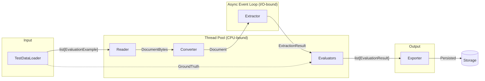
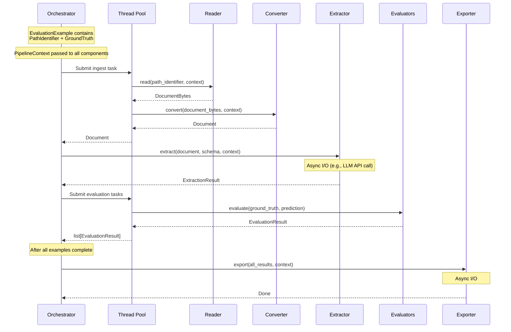
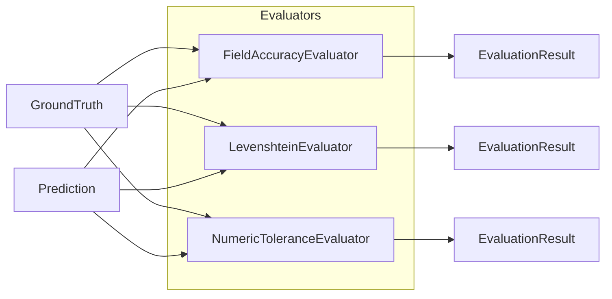
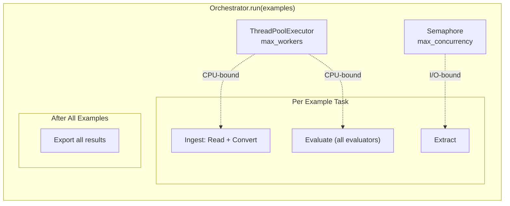

# Evaluation Pipeline

The evaluation pipeline measures extraction quality against ground truth data.

## Pipeline Flow



## Per-Example Processing

For each evaluation example, the orchestrator runs:



## Components

### 1. TestDataLoader

Loads evaluation examples (ground truth + file paths). Called **before** the orchestrator runs.

```python
from document_extraction_tools.base import BaseTestDataLoader
from document_extraction_tools.types import EvaluationExample, ExtractionResult, PathIdentifier

class MyTestDataLoader(BaseTestDataLoader[InvoiceSchema]):
    def load_test_data(
        self, path_identifier: PathIdentifier
    ) -> list[EvaluationExample[InvoiceSchema]]:
        # Load from JSON, CSV, database, etc.
        examples = []
        for row in load_ground_truth_data():
            examples.append(EvaluationExample(
                id=row["file_path"],
                path_identifier=PathIdentifier(path=row["file_path"]),
                true=ExtractionResult(data=InvoiceSchema(**row["true"])),
            ))
        return examples
```

### 2. Evaluator

Computes metrics by comparing ground truth vs predictions. Runs in the **thread pool**.

```python
from document_extraction_tools.base import BaseEvaluator
from document_extraction_tools.types import EvaluationResult, ExtractionResult, PipelineContext

class FieldAccuracyEvaluator(BaseEvaluator[InvoiceSchema]):
    def evaluate(
        self,
        true: ExtractionResult[InvoiceSchema],
        pred: ExtractionResult[InvoiceSchema],
        context: PipelineContext | None = None,
    ) -> EvaluationResult:
        # Compare fields
        total_fields = len(true.data.model_fields)
        correct = sum(
            1 for field in true.data.model_fields
            if getattr(true.data, field) == getattr(pred.data, field)
        )

        return EvaluationResult(
            name="field_accuracy",
            result=correct / total_fields,
            description="Percentage of fields correctly extracted"
        )
```

### 3. EvaluationExporter

Persists evaluation results. Called **once** after all examples are processed. Runs in the **async event loop**.

```python
from document_extraction_tools.base import BaseEvaluationExporter
from document_extraction_tools.types import Document, EvaluationResult

class MyEvaluationExporter(BaseEvaluationExporter):
    async def export(
        self, results: list[tuple[Document, list[EvaluationResult]]]
    ) -> None:
        # Save to file, database, monitoring system, etc.
        for document, eval_results in results:
            for result in eval_results:
                print(f"{document.path_identifier.path}: {result.name}={result.result}")
```

## Multiple Evaluators

You can run multiple evaluators to compute different metrics:



```python
evaluator_classes = [
    FieldAccuracyEvaluator,
    LevenshteinDistanceEvaluator,
    NumericToleranceEvaluator,
]

orchestrator = EvaluationOrchestrator.from_config(
    config=config,
    schema=InvoiceSchema,
    reader_cls=MyReader,
    converter_cls=MyConverter,
    extractor_cls=MyExtractor,
    test_data_loader_cls=MyTestDataLoader,
    evaluator_classes=evaluator_classes,
    evaluation_exporter_cls=MyEvaluationExporter,
)
```

## Concurrency Model



| Stage | Execution Model | Reason |
|-------|-----------------|--------|
| Reader | Thread pool | File I/O is blocking |
| Converter | Thread pool | CPU-bound parsing |
| Extractor | Async | Network I/O (LLM calls) |
| Evaluators | Thread pool | CPU-bound comparison |
| Exporter | Async | Network/disk I/O |

## Running Evaluation

```python
import uuid
from document_extraction_tools.config import load_evaluation_config
from document_extraction_tools.runners import EvaluationOrchestrator
from document_extraction_tools.types import PipelineContext

config = load_evaluation_config(
    test_data_loader_config_cls=MyTestDataLoaderConfig,
    evaluator_config_classes=[FieldAccuracyEvaluatorConfig],
    reader_config_cls=MyReaderConfig,
    converter_config_cls=MyConverterConfig,
    extractor_config_cls=MyExtractorConfig,
    evaluation_exporter_config_cls=MyEvaluationExporterConfig,
)

orchestrator = EvaluationOrchestrator.from_config(...)

# Load test data
examples = MyTestDataLoader(config).load_test_data(
    PathIdentifier(path="/path/to/eval-set")
)

# Run evaluation with optional context
context = PipelineContext(context={"run_id": str(uuid.uuid4())[:8]})
await orchestrator.run(examples, context=context)
```
