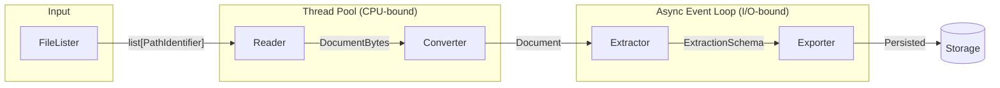
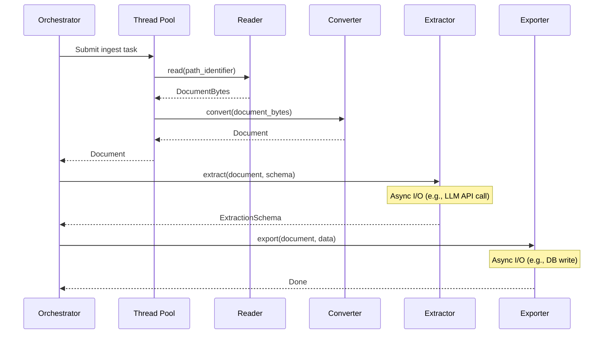
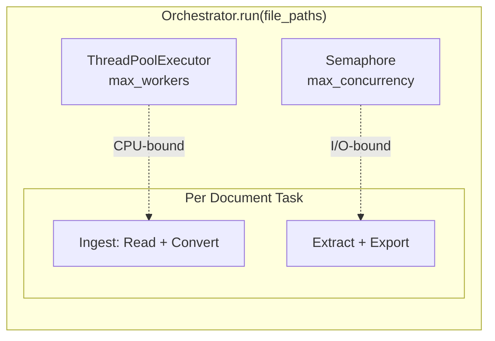

# Extraction Pipeline

The extraction pipeline transforms raw documents into structured data.

## Pipeline Flow



## Per-Document Processing

For each document, the orchestrator runs:



## Components

### 1. FileLister

Discovers input files and returns a list of `PathIdentifier` objects. Called **before** the orchestrator runs.

```python
from document_extraction_tools.base import BaseFileLister
from document_extraction_tools.types import PathIdentifier

class MyFileLister(BaseFileLister):
    def list_files(self) -> list[PathIdentifier]:
        # List files from local directory, cloud storage, database, etc.
        return [PathIdentifier(path=str(p)) for p in Path("data").glob("*.pdf")]
```

### 2. Reader

Reads raw bytes from the source and returns `DocumentBytes`. Runs in the **thread pool**.

```python
from document_extraction_tools.base import BaseReader
from document_extraction_tools.types import DocumentBytes, PathIdentifier

class MyReader(BaseReader):
    def read(self, path_identifier: PathIdentifier) -> DocumentBytes:
        with open(path_identifier.path, "rb") as f:
            return DocumentBytes(
                file_bytes=f.read(),
                mime_type="application/pdf",
                path_identifier=path_identifier,
            )
```

### 3. Converter

Converts raw bytes into a structured `Document` with pages and content. Runs in the **thread pool**.

```python
from document_extraction_tools.base import BaseConverter
from document_extraction_tools.types import Document, DocumentBytes

class MyConverter(BaseConverter):
    def convert(self, document_bytes: DocumentBytes) -> Document:
        # Use PDF library, OCR engine, etc.
        pages = parse_pdf(document_bytes.file_bytes)
        return Document(
            id=str(document_bytes.path_identifier.path),
            path_identifier=document_bytes.path_identifier,
            pages=pages,
            content_type="text",
        )
```

### 4. Extractor

Asynchronously extracts structured data into your Pydantic schema. Runs in the **async event loop**.

```python
from document_extraction_tools.base import BaseExtractor
from document_extraction_tools.types import Document

class MyExtractor(BaseExtractor):
    async def extract(self, document: Document, schema: type[T]) -> T:
        # Call LLM API, run rules engine, etc.
        response = await self.llm_client.extract(
            document=document,
            schema=schema,
        )
        return schema.model_validate(response)
```

### 5. ExtractionExporter

Asynchronously persists extracted data to your destination. Runs in the **async event loop**.

```python
from document_extraction_tools.base import BaseExtractionExporter
from document_extraction_tools.types import Document

class MyExtractionExporter(BaseExtractionExporter):
    async def export(self, document: Document, data: T) -> None:
        # Save to database, cloud storage, API, etc.
        await self.db.insert(
            path=document.path_identifier.path,
            data=data.model_dump(),
        )
```

## ExtractionOrchestrator

The orchestrator coordinates all components:

```python
from document_extraction_tools.runners import ExtractionOrchestrator

orchestrator = ExtractionOrchestrator.from_config(
    config=config,
    schema=InvoiceSchema,
    reader_cls=MyReader,
    converter_cls=MyConverter,
    extractor_cls=MyExtractor,
    exporter_cls=MyExtractionExporter,
)

# Run the pipeline
await orchestrator.run(file_paths)
```

## Concurrency Model



| Stage | Execution Model | Reason |
|-------|-----------------|--------|
| Reader | Thread pool | File I/O is blocking |
| Converter | Thread pool | CPU-bound parsing |
| Extractor | Async | Network I/O (LLM calls) |
| Exporter | Async | Network/disk I/O |

Configure via `extraction_orchestrator.yaml`:

```yaml
max_workers: 4        # Thread pool size for Reader/Converter
max_concurrency: 10   # Max concurrent Extractor/Exporter calls
```
