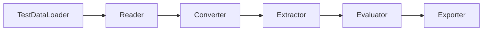

# Overview

Document Extraction Tools provides a modular framework for building document extraction and evaluation pipelines.

## Architecture

The library is built around these core principles:

1. **Interface-Driven Design** - Abstract base classes define contracts for each component
2. **Pluggable Components** - You implement the interfaces for your specific use case
3. **Concurrent Execution** - Orchestrators handle parallelism and async I/O
4. **Configuration as Code** - Pydantic models + YAML for reproducible pipelines

## Pipeline Types

### Extraction Pipeline

Transforms raw documents into structured data:


### Evaluation Pipeline

Measures extraction quality against ground truth:



## Component Overview

| Component | Purpose | Execution |
|-----------|---------|-----------|
| FileLister | Discover input files | Sync (before orchestrator) |
| Reader | Read raw bytes | Thread pool (CPU-bound) |
| Converter | Parse to Document | Thread pool (CPU-bound) |
| Extractor | Extract structured data | Async (I/O-bound) |
| Exporter | Persist results | Async (I/O-bound) |
| TestDataLoader | Load evaluation examples | Sync (before orchestrator) |
| Evaluator | Compute metrics | Thread pool (CPU-bound) |

## Concurrency Model

The orchestrators optimize for both CPU-bound and I/O-bound operations:

- **Thread Pool** - Reader and Converter run in a thread pool for CPU parallelism
- **Async I/O** - Extractor and Exporter run concurrently in the event loop
- **Semaphore Control** - `max_concurrency` limits concurrent async operations

```yaml
# Tuning options in orchestrator config
max_workers: 4        # Thread pool size
max_concurrency: 10   # Async semaphore limit
```

## Next Steps

- [Data Models](data-models.md) - Learn about the core types
- [Extraction Pipeline](extraction-pipeline.md) - Deep dive into extraction
- [Evaluation Pipeline](evaluation-pipeline.md) - Set up evaluation
- [Configuration](configuration.md) - Configure your pipelines
