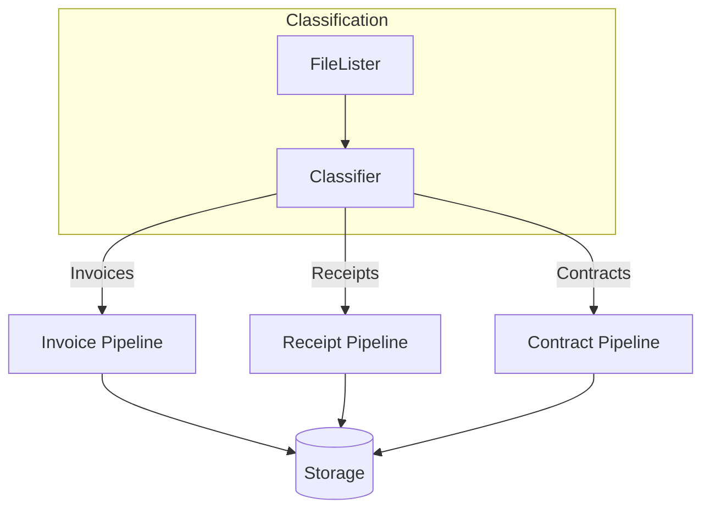
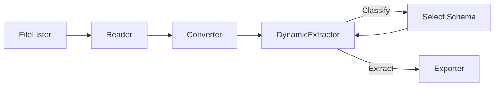

# Handling Heterogeneous Documents

This guide covers strategies for processing different document types with different extraction schemas in a unified pipeline.

## The Challenge

Real-world document processing often involves:

- **Multiple document types** (invoices, receipts, contracts, forms)
- **Different schemas per type** (each type has unique fields)
- **Mixed input sources** (a folder containing various document types)
- **Type-specific processing** (different converters or extractors per type)

The standard `ExtractionOrchestrator` processes all documents with a single schema. For heterogeneous documents, you need routing logic.

## Approach 1: Pre-Classification with Separate Pipelines

The simplest approach: classify documents first, then route to type-specific pipelines.



### Define Type-Specific Schemas

```python
from pydantic import BaseModel, Field


class InvoiceSchema(BaseModel):
    """Schema for invoice documents."""

    invoice_number: str = Field(..., description="Invoice ID")
    vendor_name: str = Field(..., description="Vendor or supplier name")
    total_amount: float = Field(..., description="Total invoice amount")
    due_date: str = Field(..., description="Payment due date")
    line_items: list[dict] = Field(default_factory=list, description="Line items")


class ReceiptSchema(BaseModel):
    """Schema for receipt documents."""

    merchant_name: str = Field(..., description="Store or merchant name")
    transaction_date: str = Field(..., description="Date of purchase")
    total: float = Field(..., description="Total amount paid")
    payment_method: str = Field(..., description="Cash, card, etc.")


class ContractSchema(BaseModel):
    """Schema for contract documents."""

    contract_type: str = Field(..., description="Type of contract")
    parties: list[str] = Field(..., description="Parties involved")
    effective_date: str = Field(..., description="Contract start date")
    termination_date: str | None = Field(None, description="Contract end date")
    key_terms: list[str] = Field(default_factory=list, description="Important terms")
```

### Implement a Document Classifier

```python
from enum import Enum
from pathlib import Path

from pydantic import BaseModel, Field

from document_extraction_tools.base import BaseExtractor
from document_extraction_tools.types import Document, ExtractionResult, PipelineContext


class DocumentType(Enum):
    INVOICE = "invoice"
    RECEIPT = "receipt"
    CONTRACT = "contract"
    UNKNOWN = "unknown"


class ClassificationResult(BaseModel):
    """Result of document classification."""

    document_type: DocumentType
    confidence: float = Field(..., ge=0.0, le=1.0)


class DocumentClassifier(BaseExtractor):
    """Classifies documents into types using an LLM.

    Note: self.llm_client represents your LLM client (e.g., OpenAI, Gemini).
    You'll need to implement this based on your chosen LLM provider.
    """

    async def extract(
        self,
        document: Document,
        schema: type[ClassificationResult],
        context: PipelineContext | None = None,
    ) -> ExtractionResult[ClassificationResult]:
        prompt = """Classify this document into one of these types:
        - invoice: Bills requesting payment for goods/services
        - receipt: Proof of purchase/payment
        - contract: Legal agreements between parties

        Return the document type and your confidence (0-1)."""

        # Use your LLM client to generate the classification
        response = await self.llm_client.generate(
            prompt=prompt,
            document=document,
            response_schema=ClassificationResult,
        )

        return ExtractionResult(
            data=ClassificationResult.model_validate(response),
        )
```

### Route to Type-Specific Pipelines

```python
import asyncio
from dataclasses import dataclass

from document_extraction_tools.runners import ExtractionOrchestrator
from document_extraction_tools.types import PathIdentifier


@dataclass
class PipelineRegistry:
    """Registry of type-specific extraction pipelines."""

    invoice_pipeline: ExtractionOrchestrator
    receipt_pipeline: ExtractionOrchestrator
    contract_pipeline: ExtractionOrchestrator

    def get_pipeline(self, doc_type: DocumentType) -> ExtractionOrchestrator | None:
        return {
            DocumentType.INVOICE: self.invoice_pipeline,
            DocumentType.RECEIPT: self.receipt_pipeline,
            DocumentType.CONTRACT: self.contract_pipeline,
        }.get(doc_type)


async def process_heterogeneous_documents(
    file_paths: list[PathIdentifier],
    classifier: DocumentClassifier,
    reader: BaseReader,
    converter: BaseConverter,
    registry: PipelineRegistry,
) -> dict[DocumentType, list[PathIdentifier]]:
    """Process documents by routing to type-specific pipelines."""

    # Step 1: Classify all documents
    classified: dict[DocumentType, list[PathIdentifier]] = {
        doc_type: [] for doc_type in DocumentType
    }

    for path in file_paths:
        doc_bytes = reader.read(path)
        document = converter.convert(doc_bytes)
        extraction_result = await classifier.extract(document, ClassificationResult)
        classification = extraction_result.data
        classified[classification.document_type].append(path)
        print(f"{path.path}: {classification.document_type.value} ({classification.confidence:.0%})")

    # Step 2: Process each type with its pipeline
    for doc_type, paths in classified.items():
        if not paths or doc_type == DocumentType.UNKNOWN:
            continue

        pipeline = registry.get_pipeline(doc_type)
        if pipeline:
            print(f"\nProcessing {len(paths)} {doc_type.value} documents...")
            await pipeline.run(paths)

    return classified
```

### Complete Example

```python
import asyncio
from pathlib import Path

from document_extraction_tools.config import load_extraction_config
from document_extraction_tools.runners import ExtractionOrchestrator


async def main():
    config_dir = Path("config/yaml")

    # Create type-specific pipelines
    invoice_config = load_extraction_config(
        lister_config_cls=LocalFileListerConfig,
        reader_config_cls=LocalReaderConfig,
        converter_config_cls=PDFConverterConfig,
        extractor_config_cls=GeminiExtractorConfig,
        extraction_exporter_config_cls=JSONExporterConfig,
        config_dir=config_dir,
    )

    invoice_pipeline = ExtractionOrchestrator.from_config(
        config=invoice_config,
        schema=InvoiceSchema,
        file_lister_cls=LocalFileLister,
        reader_cls=LocalReader,
        converter_cls=PDFConverter,
        extractor_cls=GeminiExtractor,
        extraction_exporter_cls=JSONExporter,
    )

    # Similar setup for receipt and contract pipelines...
    receipt_pipeline = ExtractionOrchestrator.from_config(
        config=invoice_config,  # Can share config or use different
        schema=ReceiptSchema,
        file_lister_cls=LocalFileLister,
        reader_cls=LocalReader,
        converter_cls=PDFConverter,
        extractor_cls=GeminiExtractor,
        extraction_exporter_cls=JSONExporter,
    )

    contract_pipeline = ExtractionOrchestrator.from_config(
        config=invoice_config,
        schema=ContractSchema,
        file_lister_cls=LocalFileLister,
        reader_cls=LocalReader,
        converter_cls=PDFConverter,
        extractor_cls=GeminiExtractor,
        extraction_exporter_cls=JSONExporter,
    )

    registry = PipelineRegistry(
        invoice_pipeline=invoice_pipeline,
        receipt_pipeline=receipt_pipeline,
        contract_pipeline=contract_pipeline,
    )

    # Initialize shared components
    reader = LocalReader(invoice_config.reader)
    converter = PDFConverter(invoice_config.converter)
    classifier = DocumentClassifier(invoice_config.extractor)

    # Get all documents
    file_lister = LocalFileLister(invoice_config.file_lister)
    file_paths = file_lister.list_files()

    # Process with routing
    results = await process_heterogeneous_documents(
        file_paths=file_paths,
        classifier=classifier,
        reader=reader,
        converter=converter,
        registry=registry,
    )

    # Summary
    print("\n--- Summary ---")
    for doc_type, paths in results.items():
        print(f"{doc_type.value}: {len(paths)} documents")


if __name__ == "__main__":
    asyncio.run(main())
```

## Approach 2: Unified Pipeline with Dynamic Schema Selection

For more complex routing or when you want a single pipeline, implement a custom extractor that selects schemas dynamically.



### Dynamic Extractor

```python
from typing import Any

from pydantic import BaseModel

from document_extraction_tools.base import BaseExtractor
from document_extraction_tools.config import BaseExtractorConfig
from document_extraction_tools.types import Document, ExtractionResult, PipelineContext


class DynamicExtractor(BaseExtractor):
    """Extractor that classifies documents and extracts with the appropriate schema.

    Note: self.llm_client represents your LLM client (e.g., OpenAI, Gemini).
    You'll need to implement this based on your chosen LLM provider.
    """

    def __init__(self, config: BaseExtractorConfig) -> None:
        super().__init__(config)
        self.schema_registry: dict[DocumentType, type[BaseModel]] = {
            DocumentType.INVOICE: InvoiceSchema,
            DocumentType.RECEIPT: ReceiptSchema,
            DocumentType.CONTRACT: ContractSchema,
        }

    async def extract(
        self,
        document: Document,
        schema: type[Any],
        context: PipelineContext | None = None,
    ) -> ExtractionResult[UniversalExtractionResult]:
        """
        Extract data using dynamic schema selection.

        Note: The schema parameter is ignored; we determine the schema dynamically.
        Returns an ExtractionResult containing a UniversalExtractionResult.
        """
        # Step 1: Classify the document
        doc_type = await self._classify(document)

        # Step 2: Get the appropriate schema
        extraction_schema = self.schema_registry.get(doc_type)
        if extraction_schema is None:
            return ExtractionResult(
                data=UniversalExtractionResult(
                    document_type=doc_type.value,
                    data=None,
                    error="Unknown document type",
                ),
            )

        # Step 3: Extract with the selected schema
        extracted = await self._extract_with_schema(document, extraction_schema)

        return ExtractionResult(
            data=UniversalExtractionResult(
                document_type=doc_type.value,
                data=extracted.model_dump(),
            ),
        )

    async def _classify(self, document: Document) -> DocumentType:
        """Classify the document type."""
        # Use LLM or rules-based classification
        prompt = "Classify this document as: invoice, receipt, or contract"
        response = await self.llm_client.generate(prompt, document)

        # Parse response to DocumentType
        type_str = response.strip().lower()
        try:
            return DocumentType(type_str)
        except ValueError:
            return DocumentType.UNKNOWN

    async def _extract_with_schema(
        self, document: Document, schema: type[BaseModel]
    ) -> BaseModel:
        """Extract data using the specified schema."""
        prompt = f"Extract the following fields: {schema.model_json_schema()}"
        response = await self.llm_client.generate(
            prompt,
            document,
            response_schema=schema,
        )
        return schema.model_validate(response)
```

### Universal Wrapper Schema

Since the orchestrator requires a single schema type, use a wrapper:

```python
from typing import Any


class UniversalExtractionResult(BaseModel):
    """Wrapper schema for heterogeneous extraction results."""

    document_type: str = Field(..., description="Detected document type")
    data: dict[str, Any] | None = Field(None, description="Extracted data")
    error: str | None = Field(None, description="Error message if extraction failed")

    def get_typed_data(self) -> BaseModel | None:
        """Convert data dict back to typed schema."""
        if self.data is None:
            return None

        schema_map = {
            "invoice": InvoiceSchema,
            "receipt": ReceiptSchema,
            "contract": ContractSchema,
        }

        schema_cls = schema_map.get(self.document_type)
        if schema_cls:
            return schema_cls.model_validate(self.data)
        return None
```

## Approach 3: Filename or Metadata-Based Routing

When document types can be determined from metadata (filename, folder, tags), avoid the classification step entirely.

```python
from pathlib import Path

from document_extraction_tools.types import PathIdentifier


class MetadataRouter:
    """Routes documents based on filename patterns or folder structure."""

    def __init__(self) -> None:
        self.rules: list[tuple[str, DocumentType]] = [
            ("invoice", DocumentType.INVOICE),
            ("inv_", DocumentType.INVOICE),
            ("receipt", DocumentType.RECEIPT),
            ("rcpt_", DocumentType.RECEIPT),
            ("contract", DocumentType.CONTRACT),
            ("agreement", DocumentType.CONTRACT),
        ]

    def classify(self, path_identifier: PathIdentifier) -> DocumentType:
        """Classify based on filename patterns."""
        filename = Path(path_identifier.path).stem.lower()

        for pattern, doc_type in self.rules:
            if pattern in filename:
                return doc_type

        return DocumentType.UNKNOWN

    def classify_by_folder(self, path_identifier: PathIdentifier) -> DocumentType:
        """Classify based on parent folder name."""
        folder = Path(path_identifier.path).parent.name.lower()

        folder_map = {
            "invoices": DocumentType.INVOICE,
            "receipts": DocumentType.RECEIPT,
            "contracts": DocumentType.CONTRACT,
        }

        return folder_map.get(folder, DocumentType.UNKNOWN)


def route_by_metadata(
    file_paths: list[PathIdentifier],
    router: MetadataRouter,
) -> dict[DocumentType, list[PathIdentifier]]:
    """Group files by document type using metadata routing."""
    grouped: dict[DocumentType, list[PathIdentifier]] = {
        doc_type: [] for doc_type in DocumentType
    }

    for path in file_paths:
        doc_type = router.classify(path)
        grouped[doc_type].append(path)

    return grouped
```

## Approach 4: Custom FileLister Per Type

Create separate file listers that only return documents of a specific type:

```python
from pathlib import Path

from document_extraction_tools.base import BaseFileLister
from document_extraction_tools.types import PathIdentifier, PipelineContext


class InvoiceFileLister(BaseFileLister):
    """Lists only invoice documents."""

    def list_files(
        self, context: PipelineContext | None = None
    ) -> list[PathIdentifier]:
        base_dir = Path(self.config.input_directory)
        paths = []

        # Pattern-based
        paths.extend(base_dir.glob("**/invoice*.pdf"))
        paths.extend(base_dir.glob("**/inv_*.pdf"))

        # Folder-based
        invoice_dir = base_dir / "invoices"
        if invoice_dir.exists():
            paths.extend(invoice_dir.glob("*.pdf"))

        return [PathIdentifier(path=str(p)) for p in paths]


class ReceiptFileLister(BaseFileLister):
    """Lists only receipt documents."""

    def list_files(
        self, context: PipelineContext | None = None
    ) -> list[PathIdentifier]:
        base_dir = Path(self.config.input_directory)
        paths = []

        paths.extend(base_dir.glob("**/receipt*.pdf"))
        paths.extend(base_dir.glob("**/rcpt_*.pdf"))

        receipt_dir = base_dir / "receipts"
        if receipt_dir.exists():
            paths.extend(receipt_dir.glob("*.pdf"))

        return [PathIdentifier(path=str(p)) for p in paths]
```

Then run separate pipelines:

```python
async def main():
    # Invoice pipeline
    invoice_files = InvoiceFileLister(config.file_lister).list_files()
    await invoice_pipeline.run(invoice_files)

    # Receipt pipeline
    receipt_files = ReceiptFileLister(config.file_lister).list_files()
    await receipt_pipeline.run(receipt_files)
```

## Choosing the Right Approach

| Approach | Best For | Complexity | Classification Cost |
|----------|----------|------------|---------------------|
| Pre-Classification | Unknown types, high accuracy needed | Medium | One LLM call per document |
| Dynamic Extractor | Single pipeline preference | Medium | One LLM call per document |
| Metadata Routing | Organized file structures | Low | None |
| Separate FileListers | Clear folder/naming conventions | Low | None |

**Decision guide:**

1. **Can you determine type from filename/folder?** → Use Approach 3 or 4
2. **Do you need high classification accuracy?** → Use Approach 1 with dedicated classifier
3. **Do you want a unified pipeline?** → Use Approach 2
4. **Are documents already sorted?** → Use Approach 4

## Handling Unknown Types

Always have a strategy for documents that don't match any known type:

```python
async def handle_unknown_documents(
    unknown_paths: list[PathIdentifier],
    output_dir: Path,
) -> None:
    """Move unknown documents to a review queue."""
    review_dir = output_dir / "needs_review"
    review_dir.mkdir(parents=True, exist_ok=True)

    for path in unknown_paths:
        # Copy to review directory
        src = Path(path.path)
        dst = review_dir / src.name
        shutil.copy2(src, dst)

        # Log for manual review
        logger.warning(f"Unknown document type: {path.path} -> {dst}")
```

## Next Steps

- See [Extraction Pipeline](../concepts/extraction-pipeline.md) for single-type pipelines
- See [Production Patterns](./production-patterns.md) for error handling
- Check the [Examples Repository](https://github.com/artefactory-uk/document-extraction-examples) for implementations
