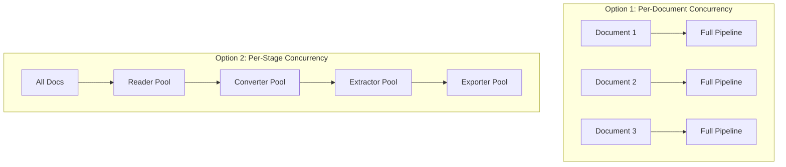

# Production Patterns

This guide covers patterns for building fault-tolerant extraction pipelines suitable for production environments. You'll learn how to use components independently, implement checkpointing, handle failures gracefully, and resume processing after interruptions.

## Why Use Components Directly?

The `ExtractionOrchestrator` is excellent for straightforward batch processing, but production systems often need:

- **Checkpointing**: Resume from where you left off after failures
- **Custom retry logic**: Retry transient failures with exponential backoff
- **Dead-letter queues**: Track and reprocess failed documents
- **Progress tracking**: Monitor pipeline status in real-time
- **Incremental processing**: Process documents as they arrive

By using components directly, you gain full control over error handling and state management.

## Using Components Without the Orchestrator

All pipeline components are designed to work independently. Here's the basic pattern:

```python
import asyncio
from pathlib import Path

from document_extraction_tools.base import (
    BaseConverter,
    BaseExtractionExporter,
    BaseExtractor,
    BaseFileLister,
    BaseReader,
)
from document_extraction_tools.types import PathIdentifier, PipelineContext


async def process_document(
    path_identifier: PathIdentifier,
    reader: BaseReader,
    converter: BaseConverter,
    extractor: BaseExtractor,
    exporter: BaseExtractionExporter,
    schema: type,
    context: PipelineContext | None = None,
) -> None:
    """Process a single document through the full pipeline."""
    # Step 1: Read raw bytes (synchronous, CPU-bound)
    document_bytes = reader.read(path_identifier, context)

    # Step 2: Convert to structured document (synchronous, CPU-bound)
    document = converter.convert(document_bytes, context)

    # Step 3: Extract data using LLM (asynchronous, I/O-bound)
    extracted_data = await extractor.extract(document, schema, context)

    # Step 4: Export results (asynchronous, I/O-bound)
    await exporter.export(document, extracted_data, context)


async def main():
    # Initialize components
    reader = MyReader(reader_config)
    converter = MyConverter(converter_config)
    extractor = MyExtractor(extractor_config)
    exporter = MyExporter(exporter_config)

    # Get files to process
    file_lister = MyFileLister(lister_config)
    file_paths = file_lister.list_files()

    # Process each document
    for path in file_paths:
        try:
            await process_document(
                path, reader, converter, extractor, exporter, MySchema
            )
            print(f"Processed: {path.path}")
        except Exception as e:
            print(f"Failed: {path.path} - {e}")


if __name__ == "__main__":
    asyncio.run(main())
```

## Fault-Tolerant Pipeline with Checkpointing

For production systems that need to resume after failures, implement checkpointing with a state store.

### State Management

First, define a checkpoint manager to track processing state:

```python
import json
from dataclasses import dataclass, field
from datetime import datetime
from enum import Enum
from pathlib import Path


class DocumentStatus(Enum):
    """Processing status for a document."""

    PENDING = "pending"
    IN_PROGRESS = "in_progress"
    COMPLETED = "completed"
    FAILED = "failed"


@dataclass
class DocumentState:
    """State for a single document."""

    path: str
    status: DocumentStatus = DocumentStatus.PENDING
    error: str | None = None
    attempts: int = 0
    last_attempt: datetime | None = None
    completed_at: datetime | None = None


@dataclass
class PipelineState:
    """State for the entire pipeline run."""

    run_id: str
    documents: dict[str, DocumentState] = field(default_factory=dict)
    started_at: datetime = field(default_factory=datetime.now)
    completed_at: datetime | None = None


class CheckpointManager:
    """Manages pipeline state persistence for fault tolerance."""

    def __init__(self, checkpoint_dir: Path) -> None:
        self.checkpoint_dir = checkpoint_dir
        self.checkpoint_dir.mkdir(parents=True, exist_ok=True)

    def _checkpoint_path(self, run_id: str) -> Path:
        return self.checkpoint_dir / f"{run_id}.json"

    def save(self, state: PipelineState) -> None:
        """Persist current state to disk."""
        checkpoint_path = self._checkpoint_path(state.run_id)
        data = {
            "run_id": state.run_id,
            "started_at": state.started_at.isoformat(),
            "completed_at": (
                state.completed_at.isoformat() if state.completed_at else None
            ),
            "documents": {
                path: {
                    "path": doc.path,
                    "status": doc.status.value,
                    "error": doc.error,
                    "attempts": doc.attempts,
                    "last_attempt": (
                        doc.last_attempt.isoformat() if doc.last_attempt else None
                    ),
                    "completed_at": (
                        doc.completed_at.isoformat() if doc.completed_at else None
                    ),
                }
                for path, doc in state.documents.items()
            },
        }
        # Atomic write with temp file
        temp_path = checkpoint_path.with_suffix(".tmp")
        temp_path.write_text(json.dumps(data, indent=2))
        temp_path.rename(checkpoint_path)

    def load(self, run_id: str) -> PipelineState | None:
        """Load state from checkpoint file."""
        checkpoint_path = self._checkpoint_path(run_id)
        if not checkpoint_path.exists():
            return None

        data = json.loads(checkpoint_path.read_text())
        state = PipelineState(
            run_id=data["run_id"],
            started_at=datetime.fromisoformat(data["started_at"]),
            completed_at=(
                datetime.fromisoformat(data["completed_at"])
                if data["completed_at"]
                else None
            ),
        )

        for path, doc_data in data["documents"].items():
            state.documents[path] = DocumentState(
                path=doc_data["path"],
                status=DocumentStatus(doc_data["status"]),
                error=doc_data["error"],
                attempts=doc_data["attempts"],
                last_attempt=(
                    datetime.fromisoformat(doc_data["last_attempt"])
                    if doc_data["last_attempt"]
                    else None
                ),
                completed_at=(
                    datetime.fromisoformat(doc_data["completed_at"])
                    if doc_data["completed_at"]
                    else None
                ),
            )

        return state

    def get_pending_documents(self, state: PipelineState) -> list[str]:
        """Get documents that haven't been successfully processed."""
        return [
            path
            for path, doc in state.documents.items()
            if doc.status in (DocumentStatus.PENDING, DocumentStatus.FAILED)
        ]
```

### Resumable Pipeline

Now implement a pipeline that can resume from checkpoints:

```python
import asyncio
import logging
import uuid
from datetime import datetime

from document_extraction_tools.types import PathIdentifier

logger = logging.getLogger(__name__)


class ResumablePipeline:
    """A fault-tolerant extraction pipeline with checkpointing."""

    def __init__(
        self,
        reader: BaseReader,
        converter: BaseConverter,
        extractor: BaseExtractor,
        exporter: BaseExtractionExporter,
        schema: type,
        checkpoint_manager: CheckpointManager,
        max_retries: int = 3,
        max_concurrency: int = 5,
    ) -> None:
        self.reader = reader
        self.converter = converter
        self.extractor = extractor
        self.exporter = exporter
        self.schema = schema
        self.checkpoint_manager = checkpoint_manager
        self.max_retries = max_retries
        self.max_concurrency = max_concurrency

    async def run(
        self,
        file_paths: list[PathIdentifier],
        run_id: str | None = None,
        context: PipelineContext | None = None,
    ) -> PipelineState:
        """
        Run the pipeline with checkpointing.

        Args:
            file_paths: Documents to process
            run_id: Resume from existing run, or None for new run
            context: Optional shared pipeline context

        Returns:
            Final pipeline state
        """
        context = context or PipelineContext()

        # Load or create state
        if run_id:
            state = self.checkpoint_manager.load(run_id)
            if state is None:
                raise ValueError(f"No checkpoint found for run_id: {run_id}")
            logger.info(f"Resuming run {run_id}")
        else:
            run_id = str(uuid.uuid4())[:8]
            state = PipelineState(run_id=run_id)
            # Initialize document states
            for path in file_paths:
                state.documents[path.path] = DocumentState(path=path.path)
            self.checkpoint_manager.save(state)
            logger.info(f"Starting new run {run_id}")

        # Get documents that need processing
        pending_paths = self.checkpoint_manager.get_pending_documents(state)
        logger.info(f"Processing {len(pending_paths)} documents")

        # Process with concurrency control
        semaphore = asyncio.Semaphore(self.max_concurrency)
        tasks = [
            self._process_with_retry(
                PathIdentifier(path=path), state, semaphore, context
            )
            for path in pending_paths
        ]

        await asyncio.gather(*tasks, return_exceptions=True)

        # Mark run as complete
        state.completed_at = datetime.now()
        self.checkpoint_manager.save(state)

        # Log summary
        completed = sum(
            1 for d in state.documents.values()
            if d.status == DocumentStatus.COMPLETED
        )
        failed = sum(
            1 for d in state.documents.values()
            if d.status == DocumentStatus.FAILED
        )
        logger.info(
            f"Run {run_id} complete: {completed} succeeded, {failed} failed"
        )

        return state

    async def _process_with_retry(
        self,
        path_identifier: PathIdentifier,
        state: PipelineState,
        semaphore: asyncio.Semaphore,
        context: PipelineContext,
    ) -> None:
        """Process a document with retry logic."""
        doc_state = state.documents[path_identifier.path]

        async with semaphore:
            while doc_state.attempts < self.max_retries:
                doc_state.attempts += 1
                doc_state.last_attempt = datetime.now()
                doc_state.status = DocumentStatus.IN_PROGRESS
                self.checkpoint_manager.save(state)

                try:
                    # Process the document
                    document_bytes = self.reader.read(path_identifier, context)
                    document = self.converter.convert(document_bytes, context)
                    extracted_data = await self.extractor.extract(
                        document, self.schema, context
                    )
                    await self.exporter.export(document, extracted_data, context)

                    # Mark as completed
                    doc_state.status = DocumentStatus.COMPLETED
                    doc_state.completed_at = datetime.now()
                    doc_state.error = None
                    self.checkpoint_manager.save(state)

                    logger.info(f"Completed: {path_identifier.path}")
                    return

                except Exception as e:
                    doc_state.error = str(e)
                    logger.warning(
                        f"Attempt {doc_state.attempts}/{self.max_retries} "
                        f"failed for {path_identifier.path}: {e}"
                    )

                    # Exponential backoff before retry
                    if doc_state.attempts < self.max_retries:
                        await asyncio.sleep(2 ** doc_state.attempts)

            # Max retries exceeded
            doc_state.status = DocumentStatus.FAILED
            self.checkpoint_manager.save(state)
            logger.error(
                f"Failed after {self.max_retries} attempts: {path_identifier.path}"
            )
```

### Usage Example

```python
import asyncio
from pathlib import Path


async def main():
    # Initialize components
    reader = LocalReader(reader_config)
    converter = PDFConverter(converter_config)
    extractor = GeminiExtractor(extractor_config)
    exporter = JSONExporter(exporter_config)

    # Create checkpoint manager
    checkpoint_manager = CheckpointManager(Path("./checkpoints"))

    # Create resumable pipeline
    pipeline = ResumablePipeline(
        reader=reader,
        converter=converter,
        extractor=extractor,
        exporter=exporter,
        schema=LeaseSchema,
        checkpoint_manager=checkpoint_manager,
        max_retries=3,
        max_concurrency=5,
    )

    # Get files to process
    file_lister = LocalFileLister(lister_config)
    file_paths = file_lister.list_files()

    # Option 1: Start new run
    state = await pipeline.run(file_paths)
    print(f"Run ID: {state.run_id}")

    # Option 2: Resume from checkpoint (after failure/restart)
    # state = await pipeline.run(file_paths, run_id="abc123")


if __name__ == "__main__":
    asyncio.run(main())
```

## Dead-Letter Queue Pattern

For documents that repeatedly fail, implement a dead-letter queue for manual review:

```python
import json
from dataclasses import dataclass
from datetime import datetime
from pathlib import Path


@dataclass
class DeadLetterEntry:
    """Entry in the dead-letter queue."""

    path: str
    error: str
    attempts: int
    failed_at: datetime
    stage: str  # Which stage failed: "read", "convert", "extract", "export"


class DeadLetterQueue:
    """Queue for documents that failed processing."""

    def __init__(self, dlq_dir: Path) -> None:
        self.dlq_dir = dlq_dir
        self.dlq_dir.mkdir(parents=True, exist_ok=True)

    def add(self, entry: DeadLetterEntry) -> None:
        """Add a failed document to the queue."""
        # Create filename from path (sanitized)
        safe_name = entry.path.replace("/", "_").replace("\\", "_")
        entry_path = self.dlq_dir / f"{safe_name}.json"

        data = {
            "path": entry.path,
            "error": entry.error,
            "attempts": entry.attempts,
            "failed_at": entry.failed_at.isoformat(),
            "stage": entry.stage,
        }
        entry_path.write_text(json.dumps(data, indent=2))

    def list_entries(self) -> list[DeadLetterEntry]:
        """List all entries in the queue."""
        entries = []
        for entry_path in self.dlq_dir.glob("*.json"):
            data = json.loads(entry_path.read_text())
            entries.append(
                DeadLetterEntry(
                    path=data["path"],
                    error=data["error"],
                    attempts=data["attempts"],
                    failed_at=datetime.fromisoformat(data["failed_at"]),
                    stage=data["stage"],
                )
            )
        return entries

    def remove(self, path: str) -> None:
        """Remove an entry from the queue after reprocessing."""
        safe_name = path.replace("/", "_").replace("\\", "_")
        entry_path = self.dlq_dir / f"{safe_name}.json"
        if entry_path.exists():
            entry_path.unlink()

    def reprocess_all(self) -> list[str]:
        """Get all paths from the queue for reprocessing."""
        return [entry.path for entry in self.list_entries()]
```

### Integrating the Dead-Letter Queue

```python
async def _process_with_retry(
    self,
    path_identifier: PathIdentifier,
    state: PipelineState,
    semaphore: asyncio.Semaphore,
    dlq: DeadLetterQueue,  # Add DLQ parameter
    context: PipelineContext,
) -> None:
    """Process a document with retry logic and DLQ support."""
    doc_state = state.documents[path_identifier.path]
    current_stage = "read"

    async with semaphore:
        while doc_state.attempts < self.max_retries:
            doc_state.attempts += 1
            doc_state.last_attempt = datetime.now()
            doc_state.status = DocumentStatus.IN_PROGRESS
            self.checkpoint_manager.save(state)

            try:
                current_stage = "read"
                document_bytes = self.reader.read(path_identifier, context)

                current_stage = "convert"
                document = self.converter.convert(document_bytes, context)

                current_stage = "extract"
                extracted_data = await self.extractor.extract(
                    document, self.schema, context
                )

                current_stage = "export"
                await self.exporter.export(document, extracted_data, context)

                # Success - mark completed
                doc_state.status = DocumentStatus.COMPLETED
                doc_state.completed_at = datetime.now()
                self.checkpoint_manager.save(state)
                return

            except Exception as e:
                doc_state.error = f"[{current_stage}] {e}"
                logger.warning(
                    f"Attempt {doc_state.attempts}/{self.max_retries} "
                    f"failed at {current_stage} for {path_identifier.path}: {e}"
                )

                if doc_state.attempts < self.max_retries:
                    await asyncio.sleep(2 ** doc_state.attempts)

        # Max retries exceeded - add to DLQ
        doc_state.status = DocumentStatus.FAILED
        self.checkpoint_manager.save(state)

        dlq.add(
            DeadLetterEntry(
                path=path_identifier.path,
                error=doc_state.error or "Unknown error",
                attempts=doc_state.attempts,
                failed_at=datetime.now(),
                stage=current_stage,
            )
        )
        logger.error(f"Added to DLQ: {path_identifier.path}")
```

## Progress Tracking

For long-running pipelines, implement progress callbacks:

```python
from dataclasses import dataclass
from typing import Callable, Protocol


@dataclass
class ProgressUpdate:
    """Progress update for the pipeline."""

    total: int
    completed: int
    failed: int
    in_progress: int
    current_document: str | None = None


class ProgressCallback(Protocol):
    """Protocol for progress callbacks."""

    def __call__(self, update: ProgressUpdate) -> None: ...


class ProgressTracker:
    """Tracks and reports pipeline progress."""

    def __init__(self, total: int, callback: ProgressCallback) -> None:
        self.total = total
        self.completed = 0
        self.failed = 0
        self.in_progress = 0
        self.current_document: str | None = None
        self.callback = callback

    def start_document(self, path: str) -> None:
        self.in_progress += 1
        self.current_document = path
        self._report()

    def complete_document(self, path: str) -> None:
        self.in_progress -= 1
        self.completed += 1
        self.current_document = None
        self._report()

    def fail_document(self, path: str) -> None:
        self.in_progress -= 1
        self.failed += 1
        self.current_document = None
        self._report()

    def _report(self) -> None:
        self.callback(
            ProgressUpdate(
                total=self.total,
                completed=self.completed,
                failed=self.failed,
                in_progress=self.in_progress,
                current_document=self.current_document,
            )
        )


# Example usage with a simple console callback
def console_progress(update: ProgressUpdate) -> None:
    pct = (update.completed + update.failed) / update.total * 100
    print(
        f"\rProgress: {pct:.1f}% "
        f"({update.completed} done, {update.failed} failed, "
        f"{update.in_progress} in progress)",
        end="",
        flush=True,
    )
```

## Database-Backed State Store

For production systems, consider using a database instead of file-based checkpoints:

```python
from abc import ABC, abstractmethod
from datetime import datetime


class StateStore(ABC):
    """Abstract interface for state persistence."""

    @abstractmethod
    def save_document_state(
        self, run_id: str, path: str, state: DocumentState
    ) -> None:
        """Save state for a single document."""

    @abstractmethod
    def load_document_state(
        self, run_id: str, path: str
    ) -> DocumentState | None:
        """Load state for a single document."""

    @abstractmethod
    def get_pending_documents(self, run_id: str) -> list[str]:
        """Get all documents pending processing."""


class PostgresStateStore(StateStore):
    """PostgreSQL-backed state store for production use."""

    def __init__(self, connection_string: str) -> None:
        import asyncpg

        self.connection_string = connection_string
        self._pool = None

    async def initialize(self) -> None:
        import asyncpg

        self._pool = await asyncpg.create_pool(self.connection_string)

        # Create tables if they don't exist
        async with self._pool.acquire() as conn:
            await conn.execute("""
                CREATE TABLE IF NOT EXISTS pipeline_runs (
                    run_id TEXT PRIMARY KEY,
                    started_at TIMESTAMP NOT NULL,
                    completed_at TIMESTAMP
                );

                CREATE TABLE IF NOT EXISTS document_states (
                    run_id TEXT NOT NULL,
                    path TEXT NOT NULL,
                    status TEXT NOT NULL,
                    error TEXT,
                    attempts INTEGER DEFAULT 0,
                    last_attempt TIMESTAMP,
                    completed_at TIMESTAMP,
                    PRIMARY KEY (run_id, path),
                    FOREIGN KEY (run_id) REFERENCES pipeline_runs(run_id)
                );

                CREATE INDEX IF NOT EXISTS idx_document_status
                ON document_states(run_id, status);
            """)

    async def save_document_state(
        self, run_id: str, path: str, state: DocumentState
    ) -> None:
        async with self._pool.acquire() as conn:
            await conn.execute(
                """
                INSERT INTO document_states
                    (run_id, path, status, error, attempts, last_attempt, completed_at)
                VALUES ($1, $2, $3, $4, $5, $6, $7)
                ON CONFLICT (run_id, path) DO UPDATE SET
                    status = EXCLUDED.status,
                    error = EXCLUDED.error,
                    attempts = EXCLUDED.attempts,
                    last_attempt = EXCLUDED.last_attempt,
                    completed_at = EXCLUDED.completed_at
                """,
                run_id,
                path,
                state.status.value,
                state.error,
                state.attempts,
                state.last_attempt,
                state.completed_at,
            )

    async def get_pending_documents(self, run_id: str) -> list[str]:
        async with self._pool.acquire() as conn:
            rows = await conn.fetch(
                """
                SELECT path FROM document_states
                WHERE run_id = $1 AND status IN ('pending', 'failed')
                """,
                run_id,
            )
            return [row["path"] for row in rows]
```

## Architectural Considerations

When designing a fault-tolerant extraction pipeline, consider these architectural trade-offs:

### State Persistence Options

| Approach | Pros | Cons | Best For |
|----------|------|------|----------|
| File-based | Simple, no dependencies | Single machine, no concurrent access | Development, small batches |
| SQLite | ACID, concurrent reads | Single machine, limited write concurrency | Medium workloads |
| PostgreSQL | Scalable, concurrent access | Operational overhead | Production systems |
| Redis | Fast, TTL support | Data loss risk without persistence | High-throughput, ephemeral state |

### Concurrency Patterns



**Per-Document Concurrency** (recommended for most cases):

- Simpler checkpointing (document-level granularity)
- Failures isolated to single documents
- Works well with `asyncio.Semaphore`

**Per-Stage Concurrency**:

- Better resource utilization for heterogeneous stages
- More complex state management
- Consider using queues (Redis, RabbitMQ) between stages

### Idempotency

Ensure your exporter is idempotent to handle duplicate processing safely:

```python
class IdempotentExporter(BaseExtractionExporter):
    """Exporter that handles duplicate exports safely."""

    async def export(
        self,
        document: Document,
        extraction_result: ExtractionResult,
        context: PipelineContext | None = None,
    ) -> None:
        # Use document ID as unique key
        existing = await self.db.get(document.id)

        if existing:
            # Update instead of insert
            await self.db.update(document.id, extraction_result.data.model_dump())
        else:
            await self.db.insert(document.id, extraction_result.data.model_dump())
```

## Summary

Building a fault-tolerant extraction pipeline requires:

1. **Using components directly** for full control over error handling
2. **Checkpointing** to persist state and enable resumption
3. **Retry logic** with exponential backoff for transient failures
4. **Dead-letter queues** for documents that exceed retry limits
5. **Progress tracking** for operational visibility
6. **Idempotent exporters** to handle duplicate processing

The patterns in this guide can be combined and adapted based on your specific requirements for throughput, reliability, and operational complexity.

## Next Steps

- Review the [Extraction Pipeline](../concepts/extraction-pipeline.md) for component details
- See [Implementing Extraction](./implementing-extraction.md) for component implementation
- Check the [Examples Repository](https://github.com/artefactory-uk/document-extraction-examples) for production examples
